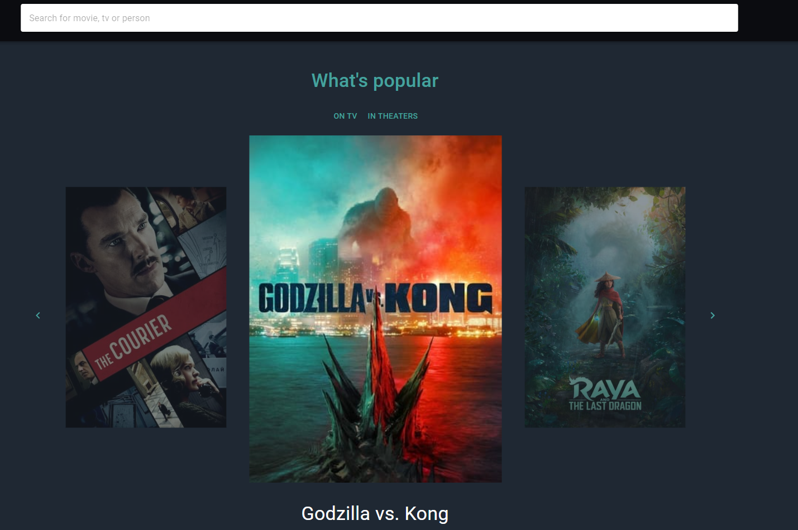
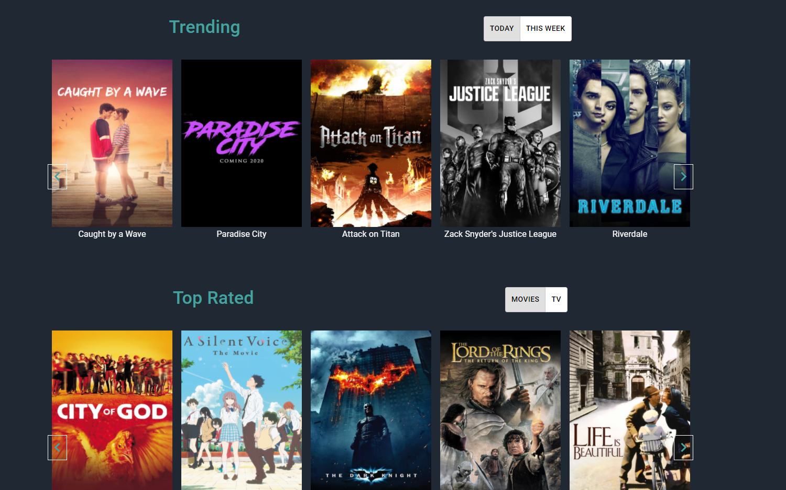

# Movies Database
> Website for browsing movies and related information about them!

## Table of contents
* [General info](#general-info)
* [Screenshots](#screenshots)
* [Technologies](#technologies)
* [Setup](#setup)
* [Features](#features)
* [Status](#status)
* [Inspiration](#inspiration)
* [Contact](#contact)

## General info
I made that project because of my passion in that industry(cinema). In additional made me really comfortable with APIs

## Screenshots

## Technologies
* React - create-react-app - version - 17.0.1
* Material-UI - version 4.11.3
* Moment - version 2.29.1
* react-player - version 2.9.0
* react-slick - version 0.28.0
* react-router-dom - version 5.2.0

## Setup
Demo: https://explore-movie-db.netlify.app/

## Features
List of features ready and TODOs for future development
* Search with autosuggest
* Dynamic filters for Popularity and Ratings

To-do list:
* Sign in
* Genre filters

## Status
Project is: _in progress_

## Contact
Created by [@Dan](https://www.linkedin.com/in/danail-kostov-ba95b81b3/) - feel free to contact me!
